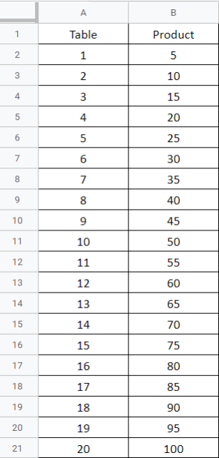
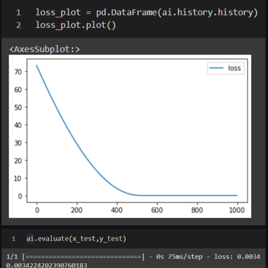

# Developing a Neural Network Regression Model

## AIM

To develop a neural network regression model for the given dataset.

## THEORY

A neural network with multiple hidden layers and multiple nodes in each hidden layer is known as a deep learning system or a deep neural network. Here the basic neural network model has been created with one input layer, one hidden layer and one output layer.The number of neurons(UNITS) in each layer varies the 1st input layer has 16 units and hidden layer has 8 units and output layer has one unit.

In this basic NN Model, we have used "relu" activation function in input and hidden layer, relu(RECTIFIED LINEAR UNIT) Activation function is a piece-wise linear function that will output the input directly if it is positive and zero if it is negative.

## Neural Network Model


## DESIGN STEPS

### STEP 1:

Loading the dataset

### STEP 2:

Split the dataset into training and testing

### STEP 3:

Create MinMaxScalar objects ,fit the model and transform the data.

### STEP 4:

Build the Neural Network Model and compile the model.

### STEP 5:

Train the model with the training data.

### STEP 6:

Plot the performance plot

### STEP 7:

Evaluate the model with the testing data.

## PROGRAM

DEVELOPE BY: KISHORE KUMAR S

REG NO : 212221240023

### Importing Modules  
```
from google.colab import auth
import gspread
from google.auth import default

import pandas as pd
from sklearn.model_selection import train_test_split
from sklearn.preprocessing import MinMaxScaler
import matplotlib.pyplot as plt

from tensorflow.keras.models import Sequential as Seq
from tensorflow.keras.layers import Dense as Den
from tensorflow.keras.metrics import RootMeanSquaredError as rmse
```
### Authenticate & Create Dataframe using Data in Sheets
```

auth.authenticate_user()
creds, _ = default()
gc = gspread.authorize(creds)

sheet = gc.open('Multiple').sheet1 
rows = sheet.get_all_values()

df = pd.DataFrame(rows[1:], columns=rows[0])
df = df.astype({'Table':'int'})
df = df.astype({'Product':'int'})
```
### Assign X and Y values
```
x = df[["Table"]] .values
y = df[["Product"]].values
```
### Normalize the values & Split the data
```
scaler = MinMaxScaler()
scaler.fit(x)
x_n = scaler.fit_transform(x)

x_train,x_test,y_train,y_test = train_test_split(x_n,y,test_size = 0.3,random_state = 3)

```
### Create a Neural Network & Train it

```
ai = Seq([
    Den(8,activation = 'relu',input_shape=[1]),
    Den(15,activation = 'relu'),
    Den(1),
])

ai.compile(optimizer = 'rmsprop',loss = 'mse')

ai.fit(x_train,y_train,epochs=2000)
ai.fit(x_train,y_train,epochs=2000)
```

### Plot the Loss
```
loss_plot = pd.DataFrame(ai.history.history)
loss_plot.plot()
```
### Evaluate the model
```
err = rmse()
preds = ai.predict(x_test)
err(y_test,preds)
```
### Predict for some value
```
x_n1 = [[30]]
x_n_n = scaler.transform(x_n1)
ai.predict(x_n_n)
```


## Dataset Information



## OUTPUT

### Training Loss Vs Iteration Plot


### Test Data Root Mean Squared Error


### New Sample Data Prediction


## RESULT
Thus a neural network regression model for the given dataset is written and executed successfully
